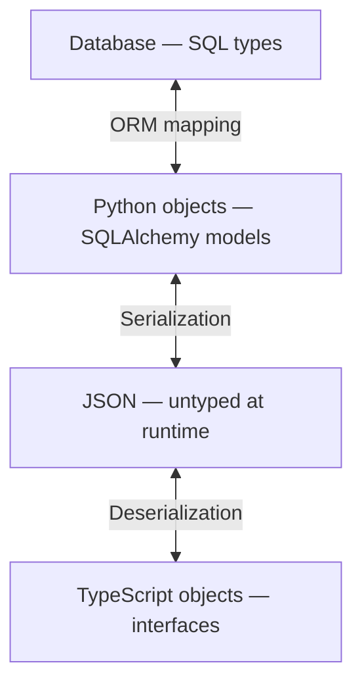

# Same App, 5x the Code: Anatomy of a Full-Stack Polyglot Tax

We built the exact same app twice. Once in Jac. Once with FastAPI, SQLAlchemy, LangChain, React, TypeScript, Vite, and Bun — the state-of-the-art (SOTA) stack that a senior engineer would reach for today. Same features, same UI, same AI-powered categorization, same persistence. Both QA-verified to behave identically.

The Jac version is **1 file, 46 lines** of application code. The SOTA version is **11 files, 233 lines**.

These are good tools. FastAPI is arguably the best Python API framework. SQLAlchemy is the most mature Python ORM. LangChain is the dominant LLM orchestration library. React and TypeScript need no introduction. We picked the best of each category on purpose — this isn't a comparison against straw men.

And yet, building with the best-in-class version of every tool still produces ~5x more application code across 11x more files than expressing the same idea in a language designed to handle the full stack. We're calling this the **polyglot tax** — the code you write not to solve your problem, but to make your tools talk to each other across language, runtime, and type-system boundaries. This article is a line-by-line anatomy of where that tax shows up and what it costs.


## The Complete Jac App

Here's the whole thing. One source file.

### `main.jac`

```jac
node Todo {
    has title: str,
        category: str = "other",
        done: bool = False;
}

enum Category { WORK, PERSONAL, SHOPPING, HEALTH, OTHER }

def categorize(title: str) -> Category by llm();

def:pub add_todo(title: str) -> Todo {
    try {
        category = str(categorize(title)).split(".")[-1].lower();
    } except Exception { }
    root() ++> (todo := Todo(title=title, category=category));
    return todo;
}

def:pub get_todos -> list[Todo] {
    return [root()-->][?:Todo];
}

cl def:pub app -> JsxElement {
    has todos: list[Todo] = [],
        text: str = "";

    async can with entry {
        todos = await get_todos();
    }

    async def add {
        if text.strip() {
            todo = await add_todo(text.strip());
            todos = todos + [todo];
            text = "";
        }
    }

    return
        <div>
            <input
                value={text}
                onChange={lambda e: ChangeEvent { text = e.target.value;}}
                onKeyPress={lambda e: KeyboardEvent { if e.key == "Enter" { add(); }}}
                placeholder="Add a todo..."
            />
            <button onClick={add}>Add</button>
            {[<p key={jid(t)}>{t.title} ({t.category})</p> for t in todos]}
        </div>;
}
```

Now let's walk through each section and see what the same intent looks like in the SOTA stack.

---

## Section 1: The Data Model

### Jac — 5 lines

```jac
node Todo {
    has title: str,
        category: str = "other",
        done: bool = False;
}
```

A `node` is a persistent data object in Jac's graph. You declare fields with types and defaults. The runtime handles storage. There's no ORM because there's no object-relational gap to bridge — the graph *is* the database.

### SOTA — 14 lines

**`models.py`**:

```python
from sqlalchemy import Column, Integer, String, Boolean
from sqlalchemy.orm import declarative_base

Base = declarative_base()


class Todo(Base):
    __tablename__ = "todos"

    id = Column(Integer, primary_key=True, index=True)
    title = Column(String, nullable=False)
    category = Column(String, default="other")
    done = Column(Boolean, default=False)
```

SQLAlchemy is doing its job well here. The declarative syntax is readable, the column types are explicit, the defaults are clear. If you need relational storage, this is about as clean as it gets.

But notice what's required that has nothing to do with the problem: a base class, a table name, a manual primary key with index configuration, and every field wrapped in a `Column()` constructor that re-declares the type. The `Column(String, nullable=False)` around `title` isn't expressing that title is a string — it's expressing that the *database column* for title is a string. It's a description of the storage layer dressed up as a data model.

This is the object-relational impedance mismatch — a term from the '90s for a problem that's still with us. Object-oriented programs think in graphs of references. Relational databases think in flat tables with foreign keys. The ORM exists to translate between these two worldviews. It's good at it. But the translation is never free, and it doesn't stay contained in one file — as we'll see when we get to `main.py`, the session management and object-to-response conversion spread the cost across the whole application.

**Expansion factor: ~3x**

---

## Section 2: AI Categorization

### Jac — 3 lines

```jac
enum Category { WORK, PERSONAL, SHOPPING, HEALTH, OTHER }

def categorize(title: str) -> Category by llm();
```

This is where the comparison gets interesting.

`by llm()` uses the type signature as the specification for the LLM call. The function takes a `str`, returns a `Category`, and the compiler handles everything in between: prompt construction, API call, response parsing, and validation against the enum. The type is the contract.

### SOTA — 48 lines

**`categorize.py`**:

```python
import os
from enum import Enum

from langchain_anthropic import ChatAnthropic
from langchain_core.prompts import ChatPromptTemplate


class Category(str, Enum):
    WORK = "work"
    PERSONAL = "personal"
    SHOPPING = "shopping"
    HEALTH = "health"
    OTHER = "other"


_prompt = ChatPromptTemplate.from_messages([
    ("system",
     "Categorize the following todo item into exactly one of these categories: "
     "WORK, PERSONAL, SHOPPING, HEALTH, OTHER. "
     "Respond with ONLY the category name, nothing else."),
    ("human", "{title}"),
])

_llm = None


def _get_llm():
    global _llm
    if _llm is None:
        _llm = ChatAnthropic(
            model="claude-sonnet-4-20250514",
            api_key=os.environ.get("ANTHROPIC_API_KEY", ""),
        )
    return _llm


async def categorize(title: str) -> str:
    try:
        llm = _get_llm()
        chain = _prompt | llm
        result = await chain.ainvoke({"title": title})
        cat = result.content.strip().lower()
        # Validate against enum
        if cat in [c.value for c in Category]:
            return cat
        return "other"
    except Exception:
        return "other (setup AI key)"
```

LangChain is well-engineered. The `ChatPromptTemplate` → `ChatAnthropic` → `chain.ainvoke()` pipeline is clean, composable, and testable. The prompt/model/chain separation gives you hooks for swapping models, adding retries, logging intermediate results, or A/B testing prompts. If you need that flexibility, LangChain earns its complexity.

But look at what you're actually doing with those hooks in this case.

The system prompt is a natural language re-statement of something you already expressed as a type:

```python
class Category(str, Enum):
    WORK = "work"
    ...
```

The enum says "these are the five valid values." The prompt says "these are the five valid values, and please only return one of them, and don't add anything else." Same information, two representations — one precise, one defensive. English is ambiguous, so you have to hedge: "respond with ONLY the category name, nothing else." That hedging is doing the job that a return type does in a typed language.

Then the validation at the bottom says it a third time:

```python
if cat in [c.value for c in Category]:
    return cat
return "other"
```

Three representations of one fact. The enum, the prompt, and the validator must all agree. When they don't — say you add `URGENT` to the enum but forget the prompt — the bug is silent. The LLM never sees the new category. The validator never rejects anything. Your todos just never get categorized as urgent. No error, no warning, just wrong behavior.

And notice the return type: `async def categorize(title: str) -> str`. Not `-> Category`. The type safety you had in the enum definition has evaporated by the time you get a response. The LLM returns a string, so the function returns a string, and from here on out the category is untyped.

The deeper issue is about what the right interface to an LLM looks like. A type signature is a more precise specification than a natural language prompt. `def categorize(title: str) -> Category` is unambiguous. The prompt version tries to say the same thing in English, but English is a lossy medium — you need defensive instructions to constrain the output format, and even then you need validation because you can't be sure the LLM obeyed.

`by llm()` treats the type as the spec and derives everything else. Add `URGENT` to the enum and the compiler adjusts the prompt and validation automatically. One source of truth, zero drift.

**Expansion factor: ~16x**

---

## Section 3: The API Layer

### Jac — 10 lines

```jac
def:pub add_todo(title: str) -> Todo {
    try {
        category = str(categorize(title)).split(".")[-1].lower();
    } except Exception { }
    root() ++> (todo := Todo(title=title, category=category));
    return todo;
}

def:pub get_todos -> list[Todo] {
    return [root()-->][?:Todo];
}
```

`def:pub` makes a function a public API endpoint. The type signature becomes the API contract — input types are the request schema, the return type is the response schema. Persistence is `root() ++> todo` (connect a node to the graph root). Querying is `[root()-->][?:Todo]` (traverse from root, filter by type).

### SOTA — 70 lines

**`main.py`**:

```python
from contextlib import asynccontextmanager
from pathlib import Path

from fastapi import FastAPI
from fastapi.staticfiles import StaticFiles
from fastapi.responses import FileResponse
from pydantic import BaseModel
from sqlalchemy.ext.asyncio import AsyncSession, create_async_engine
from sqlalchemy.future import select
from sqlalchemy.orm import sessionmaker

from categorize import categorize
from models import Base, Todo

DATABASE_URL = "sqlite+aiosqlite:///./todos.db"

engine = create_async_engine(DATABASE_URL, echo=False)
async_session = sessionmaker(engine, class_=AsyncSession, expire_on_commit=False)

FRONTEND_DIR = Path(__file__).parent / "frontend" / "dist"


@asynccontextmanager
async def lifespan(app: FastAPI):
    async with engine.begin() as conn:
        await conn.run_sync(Base.metadata.create_all)
    yield
    await engine.dispose()


app = FastAPI(lifespan=lifespan)


class AddTodoRequest(BaseModel):
    title: str


class TodoResponse(BaseModel):
    id: int
    title: str
    category: str
    done: bool


@app.post("/api/add_todo", response_model=TodoResponse)
async def add_todo(req: AddTodoRequest):
    category = await categorize(req.title)
    todo = Todo(title=req.title, category=category, done=False)
    async with async_session() as session:
        session.add(todo)
        await session.commit()
        await session.refresh(todo)
        return TodoResponse(id=todo.id, title=todo.title, category=todo.category, done=todo.done)


@app.get("/api/get_todos", response_model=list[TodoResponse])
async def get_todos():
    async with async_session() as session:
        result = await session.execute(select(Todo))
        todos = result.scalars().all()
        return [TodoResponse(id=t.id, title=t.title, category=t.category, done=t.done) for t in todos]


# Serve built React frontend
if FRONTEND_DIR.exists():
    app.mount("/assets", StaticFiles(directory=FRONTEND_DIR / "assets"), name="assets")

    @app.get("/{full_path:path}")
    async def serve_spa(full_path: str):
        return FileResponse(FRONTEND_DIR / "index.html")
```

FastAPI is excellent. The decorator-based routing is clean, the automatic OpenAPI docs are a genuine productivity win, and the Pydantic integration catches malformed requests before your code runs. This is a well-designed framework.

But this file is worth reading carefully, because it's where the polyglot tax is most concentrated. Let's walk through the distinct concerns:

**The database connection** (lines 15-18) — A URL string, an async engine, and a session factory. Three objects to say "I want a database." The separation of engine from session factory is good library architecture — it separates connection pooling from the unit-of-work pattern. But in application code, it's three things you configure once and never think about again.

**The lifecycle coordinator** (lines 22-30) — An async context manager that creates tables on startup and disposes the engine on shutdown. This exists because SQLAlchemy and FastAPI have independent lifecycles. Each tool manages its own initialization and teardown, so you need glue code at the intersection. Both tools are doing the right thing internally; the code exists because they weren't designed together.

**The Pydantic models** (lines 33-42) — This is where it gets revealing. `AddTodoRequest` and `TodoResponse` look like your data model, but they're not. They're *translations* of your data model into a form FastAPI can serialize to JSON. The SQLAlchemy `Todo` in `models.py` is the database representation. These Pydantic classes are the API representation. They have the same fields. They mean the same thing. They're maintained separately.

This is the **triple-model problem** — the signature symptom of the polyglot tax. You define your data once in SQLAlchemy (for the database), once in Pydantic (for the API), and — as we'll see in the next section — once in TypeScript (for the frontend). Three definitions of the same shape, in three different languages, maintained by three different tools. No automated check that they agree. When one drifts, you get a runtime error in production, not a compile error during development.

Tools like SQLModel try to unify the SQLAlchemy and Pydantic layers. OpenAPI code generators try to bridge Pydantic and TypeScript. These are good efforts — but they're fixing a problem caused by having three separate type systems in the first place.

**The endpoints** (lines 45-60) — The actual business logic per endpoint is about two lines: call categorize and create a todo, or query all todos. The rest is framework ceremony: decorator with route and response model, async session context manager, explicit add/commit/refresh, manual field-by-field conversion from SQLAlchemy object to Pydantic object.

That last part — `TodoResponse(id=todo.id, title=todo.title, ...)` — is particularly telling. You're manually copying fields from one object to another object that has the same fields. This is the impedance mismatch from `models.py` leaking into the API layer. It's not a lot of code per endpoint, but it scales linearly: fifty endpoints means fifty places where you're copying fields between objects that represent the same thing.

**Static file serving** (lines 64-69) — The backend serving the frontend's compiled assets. This exists because the frontend is a separate application. In Jac, `cl def` compiles into the server's asset pipeline — there's nothing to serve separately.

**Expansion factor: ~7x**

---

## Section 4: The Frontend

### Jac — 28 lines (inline in `main.jac`)

```jac
cl def:pub app -> JsxElement {
    has todos: list[Todo] = [],
        text: str = "";

    async can with entry {
        todos = await get_todos();
    }

    async def add {
        if text.strip() {
            todo = await add_todo(text.strip());
            todos = todos + [todo];
            text = "";
        }
    }

    return
        <div>
            <input
                value={text}
                onChange={lambda e: ChangeEvent { text = e.target.value;}}
                onKeyPress={lambda e: KeyboardEvent { if e.key == "Enter" { add(); }}}
                placeholder="Add a todo..."
            />
            <button onClick={add}>Add</button>
            {[<p key={jid(t)}>{t.title} ({t.category})</p> for t in todos]}
        </div>;
}
```

Three things here are easy to miss because Jac makes them invisible:

**The type `Todo` is the same `Todo` from the data model.** When `cl def` references `list[Todo]`, it's the node type from the top of the file. Not a TypeScript interface that mirrors it. Not a copy-pasted shape. The compiler ensures the frontend and backend agree on what a Todo looks like, because they're literally the same type.

**`get_todos()` and `add_todo()` are called like local functions.** They're `def:pub` — they live on the server. The compiler sees a `cl def` calling a `def:pub` and generates the HTTP fetch, JSON serialization, and deserialization. You write a function call. The compiler writes the network layer. No string URLs, no manual `fetch()`, no `Content-Type` headers.

**`has` means state, everywhere.** `has todos: list[Todo] = []` compiles to a React `useState` hook. But it's the same `has` keyword used for node fields and class properties. The concept is portable: `has` means "state owned by this scope," whether that scope is a database node, a server function, or a browser component.

### What the SOTA frontend reveals about type boundaries

Before looking at the SOTA code, it's worth understanding what happens to your types when they cross the network.

In a SOTA full-stack app, your data crosses four type boundaries:



Each boundary loses type information. The SQLAlchemy `Column(String)` becomes a Python `str`, which serializes to a JSON string, which you hope matches the TypeScript `string` on the other side. No compiler checks that the Python `Todo` and the TypeScript `Todo` agree. They're in different languages, different type systems, different processes, potentially different machines.

Full-stack TypeScript (Next.js, tRPC) gained popularity partly because it collapses the Python ↔ TypeScript boundary by using one language end-to-end. That's a real improvement. But it still has the database boundary (Prisma, Drizzle), and it doesn't touch the LLM boundary (you still write prompts and parse strings).

Jac collapses all four. One type, from database to server to client to LLM.

### SOTA — 101 lines across 8 files

**`frontend/src/types.ts`** — The TypeScript shadow of the backend:

```typescript
export interface Todo {
  id: number;
  title: string;
  category: string;
  done: boolean;
}
```

Six lines that must manually mirror the Pydantic `TodoResponse` on the backend, which itself mirrors the SQLAlchemy `Todo` in `models.py`. This is the third copy of the same shape. Add a field to any one of the three and forget the others, and the app breaks — silently on the frontend, because `fetch().json()` returns `any` and TypeScript can't check what the network actually sends.

Code generators (OpenAPI, GraphQL) try to automate this. They work, but they're an additional build step with its own configuration, and they address a symptom. The disease is having three separate type systems.

**`frontend/src/App.tsx`** — The React component:

```tsx
import { useState, useEffect } from "react";
import type { Todo } from "./types";

function App() {
  const [todos, setTodos] = useState<Todo[]>([]);
  const [text, setText] = useState("");

  useEffect(() => {
    fetch("/api/get_todos")
      .then((r) => r.json())
      .then(setTodos);
  }, []);

  async function add() {
    if (!text.trim()) return;
    const res = await fetch("/api/add_todo", {
      method: "POST",
      headers: { "Content-Type": "application/json" },
      body: JSON.stringify({ title: text.trim() }),
    });
    const todo: Todo = await res.json();
    setTodos([...todos, todo]);
    setText("");
  }

  return (
    <div>
      <input
        value={text}
        onChange={(e) => setText(e.target.value)}
        onKeyDown={(e) => {
          if (e.key === "Enter") add();
        }}
        placeholder="Add a todo..."
      />
      <button onClick={add}>Add</button>
      {todos.map((t) => (
        <p key={t.id}>
          {t.title} ({t.category})
        </p>
      ))}
    </div>
  );
}

export default App;
```

The JSX is essentially the same as the Jac version — React is React, and Jac compiles to React. The difference is in the data plumbing above the `return`.

The `add` function is 7 lines of fetch ceremony — method, headers, content type, `JSON.stringify`, `await res.json()` — where Jac has one line: `todo = await add_todo(text.strip())`. That's the polyglot tax at the network boundary. Every API call needs you to specify the HTTP method, serialization format, and deserialization step. These are all things the compiler could derive from the function signature, and in Jac, it does.

Also note: `fetch("/api/add_todo")` is a string. Typo it and you get a 404 at runtime. Change the endpoint name on the backend and forget to update it here, and same result. There's no compilation step that verifies client and server agree on route names. The Jac version can't have this bug — the function call is resolved by the compiler.

**`frontend/src/main.tsx`** — React DOM bootstrap:

```tsx
import { StrictMode } from 'react'
import { createRoot } from 'react-dom/client'
import App from './App.tsx'

createRoot(document.getElementById('root')!).render(
  <StrictMode>
    <App />
  </StrictMode>,
)
```

Every React app has this. It's identical in every project. It exists because React is a library that doesn't own the entry point.

**`frontend/index.html`** — The HTML shell:

```html
<!doctype html>
<html lang="en">
  <head>
    <meta charset="UTF-8" />
    <link rel="icon" type="image/svg+xml" href="/favicon.svg" />
    <meta name="viewport" content="width=device-width, initial-scale=1.0" />
    <title>frontend</title>
  </head>
  <body>
    <div id="root"></div>
    <script type="module" src="/src/main.tsx"></script>
  </body>
</html>
```

The `<div id="root">` that `main.tsx` targets. Every SPA has this.

**`frontend/vite.config.ts`** — Build tool configuration:

```typescript
import { defineConfig } from 'vite'
import react from '@vitejs/plugin-react'

export default defineConfig({
  plugins: [react()],
  server: {
    port: 3000,
    proxy: {
      '/api': 'http://localhost:8001',
    },
  },
})
```

The dev proxy is worth pausing on. `'/api': 'http://localhost:8001'` tells Vite to forward API requests to the backend, because during development they're running as separate processes on separate ports. This configuration exists because the frontend and backend are different applications that happen to work together. In Jac, they're the same application — there's no proxy because there's no split.

**`frontend/tsconfig.json`** and **`frontend/tsconfig.app.json`** — TypeScript compiler config:

```json
{
  "files": [],
  "references": [
    { "path": "./tsconfig.app.json" }
  ]
}
```

```json
{
  "compilerOptions": {
    "tsBuildInfoFile": "./node_modules/.tmp/tsconfig.app.tsbuildinfo",
    "target": "es2023",
    "lib": ["ES2023", "DOM", "DOM.Iterable"],
    "module": "esnext",
    "types": ["vite/client"],
    "skipLibCheck": true,
    "moduleResolution": "bundler",
    "allowImportingTsExtensions": true,
    "verbatimModuleSyntax": true,
    "moduleDetection": "force",
    "noEmit": true,
    "jsx": "react-jsx",
    "noUnusedLocals": true,
    "noUnusedParameters": true,
    "erasableSyntaxOnly": true,
    "noFallthroughCasesInSwitch": true
  },
  "include": ["src"]
}
```

31 lines of compiler configuration across two files. Target, module resolution, JSX transform, linting rules, build output. Every project configures these slightly differently. This is the polyglot tax in its purest form — TypeScript, Vite, and React each need to be told about each other, and the tsconfig is where that negotiation happens.

**`frontend/package.json`** — Dependencies:

```json
{
  "name": "frontend",
  "private": true,
  "version": "0.0.0",
  "type": "module",
  "scripts": {
    "dev": "vite",
    "build": "tsc -b && vite build",
    "preview": "vite preview"
  },
  "dependencies": {
    "react": "^19.2.4",
    "react-dom": "^19.2.4"
  },
  "devDependencies": {
    "@types/react": "^19.2.14",
    "@types/react-dom": "^19.2.3",
    "@vitejs/plugin-react": "^6.0.1",
    "typescript": "~6.0.2",
    "vite": "^8.0.4"
  }
}
```

Seven dependencies for a todo app frontend. Notice `@types/react` and `@types/react-dom` — these exist because React is written in JavaScript and the type definitions are maintained as a separate package by a separate team. The types and the runtime can version independently. The polyglot tax shows up even *within* the frontend ecosystem.

**Expansion factor: ~3.6x**

---

## The Full Scorecard

| Section | Jac | SOTA | Factor |
|---------|-----|------|--------|
| Data model | 5 lines | 14 lines, 1 file | 2.8x |
| AI categorization | 3 lines | 48 lines, 1 file | 16x |
| API + server | 10 lines | 70 lines, 1 file | 7x |
| Frontend | 28 lines | 101 lines, 8 files | 3.6x |
| **Total** | **46 lines, 1 file** | **233 lines, 11 files** | **~5x**

---

## Where the Extra 187 Lines Come From

The extra code isn't random — it falls into clear categories:

**Boundary translations** — The triple-model problem. `Todo` defined in SQLAlchemy, re-defined in Pydantic, re-defined in TypeScript. Field-by-field copying between objects that represent the same thing. The `TodoResponse(id=todo.id, title=todo.title, ...)` calls in every endpoint. The `types.ts` that must stay in sync with `models.py` by human discipline alone.

**Coordination plumbing** — The engine, session factory, lifespan manager. The singleton LLM client with lazy initialization. The static file mount. The Vite proxy config. Code that coordinates tools with independent lifecycles.

**Prompt restating** — The natural language prompt that re-explains what the enum already says, plus the validation logic that re-checks what the type system should have guaranteed.

**Scaffolding** — `main.tsx`, `index.html`, and the five config files in Section 5. Files that exist in every project of this shape, configured slightly differently each time, representing the cost of composing independent tools.

None of this code is *wrong*. Every line exists for a reason. The SOTA tools are doing their jobs. But most of the code is paying the polyglot tax — shuttling data across boundaries between systems that don't share a type system or a runtime.

## Types Across Every Boundary

The thread that connects all four sections is **types**, and what happens to them at boundaries.

In the SOTA version, the `Todo` type exists in four representations: a SQLAlchemy class, a Pydantic model, a TypeScript interface, and (implicitly) the structure the LLM prompt describes in English. These representations are maintained independently, in different languages, by different tools. When they agree, the app works. When they drift, the bugs are silent — wrong fields, missing data, miscategorized items — because the failures happen at runtime across process boundaries where no compiler is watching.

In Jac, there's one `Todo`. The `node` declaration is the type. That type flows to the API layer (via `def:pub`), to the frontend (via `cl def`), and to the LLM (via `by llm()`). The compiler enforces consistency at every boundary because it owns every boundary. Adding a field to `Todo` updates the database schema, the API contract, the frontend type, and the LLM's understanding of the data structure — in one edit.

This isn't just about convenience. It's about where bugs can hide. In the SOTA version, the surface area for type-mismatch bugs is proportional to the number of boundaries times the number of types. In Jac, that surface area is zero, because there are no boundaries to mismatch across.

## Scaling

A reasonable question: this is a todo app. Does this matter for real applications?

The polyglot tax scales linearly. A production app with fifty models and two hundred endpoints needs fifty SQLAlchemy classes, fifty Pydantic models, fifty TypeScript interfaces, and two hundred endpoints each with their own session management and object conversion. The ceremony-per-feature ratio stays the same.

The type-drift risk scales worse than linearly. With fifty types, the number of pairwise boundaries that can mismatch grows combinatorially. In practice, teams manage this with code generation, shared schemas, integration tests, and code review discipline. These all work. They're also all overhead that exists to compensate for the lack of a shared type system.

## Try It Yourself

Both versions are open source and runnable. The full code lives at [github.com/marsninja/polyglot_tax](https://github.com/marsninja/polyglot_tax):

- **`jac/`** — The Jac version. Run with `jac start`.
- **`sota/`** — The SOTA version. Run with `./run.sh` (requires Python 3.12+, Bun, and an `ANTHROPIC_API_KEY`).

We QA-tested both with the same automated browser test suite — add via button, add via Enter, empty/whitespace rejection, XSS safety, AI categorization across all five categories, and data persistence after reload. Both pass every test. Same app, same behavior, same results. One takes 46 lines and the other takes 233.

## What This Comparison Is and Isn't

This isn't an argument that the SOTA tools are bad. They're the best versions of their respective categories. FastAPI is an excellent framework. SQLAlchemy is a battle-tested ORM. LangChain handles real-world LLM orchestration complexity. React and TypeScript are industry standards for good reason.

The argument is that **the best tools, composed together, still produce substantial code that exists only to pay the polyglot tax**. The session factories, the Pydantic shadows, the TypeScript mirrors, the fetch ceremony, the prompt re-statements — none of this is expressing what the application does. It's expressing how the tools talk to each other.

Every era of developer tooling has eliminated a category of this kind of code. Compilers eliminated manual machine code. Garbage collectors eliminated manual memory management. ORMs eliminated hand-written SQL strings. React eliminated manual DOM manipulation. Each was called "too magical" at the time, and each turned out to be worth it because the code it eliminated wasn't carrying its weight.

Jac eliminates the polyglot tax by eliminating the polyglot. One language across storage, API, frontend, and AI. It's not magic — it's a compiler that owns the full stack, so it can enforce types and generate plumbing across boundaries that no single SOTA tool can see.

The 187 extra lines aren't wrong. They're just not doing what you hired them to do.

---

## Bonus: The Configuration Tax

The scorecard above covers application code only. But the polyglot tax extends to project configuration too — and the ratio there tells its own story.

### Jac — 34 lines, 1 file

`jac.toml` declares everything in one place: Python dependencies, npm dependencies, dev dependencies, server config, plugin config, and LLM model selection. Both ecosystems, one file. `jac start` reads it and does the rest.

### SOTA — 78 lines across 5 files

The same concerns are spread across five files in two ecosystems:

- **`pyproject.toml`** (13 lines) — Six Python runtime dependencies: web framework, server, ORM, database driver, two LangChain packages.
- **`frontend/package.json`** (22 lines) — Seven npm dependencies. Build scripts chain two tools: `"build": "tsc -b && vite build"`.
- **`frontend/vite.config.ts`** (12 lines) — The dev proxy `'/api': 'http://localhost:8001'` exists because frontend and backend are separate processes.
- **`frontend/tsconfig.json`** + **`frontend/tsconfig.app.json`** (31 lines) — TypeScript compiler configuration negotiating between TypeScript, Vite, and React.

### The pattern

The Jac config is one file because Jac owns the full stack. The SOTA config is five files because five tools need to be told about each other. The `pyproject.toml` doesn't know about `package.json`. The `tsconfig` doesn't know about `pyproject.toml`. The `vite.config.ts` needs to know about both. Each file is a point of configuration for a tool designed in isolation, and the developer's job is to make them agree.

**Configuration expansion: 34 lines → 78 lines (2.3x), 1 file → 5 files.**

Including configuration, the full totals become **80 lines, 2 files** (Jac) vs **311 lines, 16 files** (SOTA) — still roughly a 4x gap.
